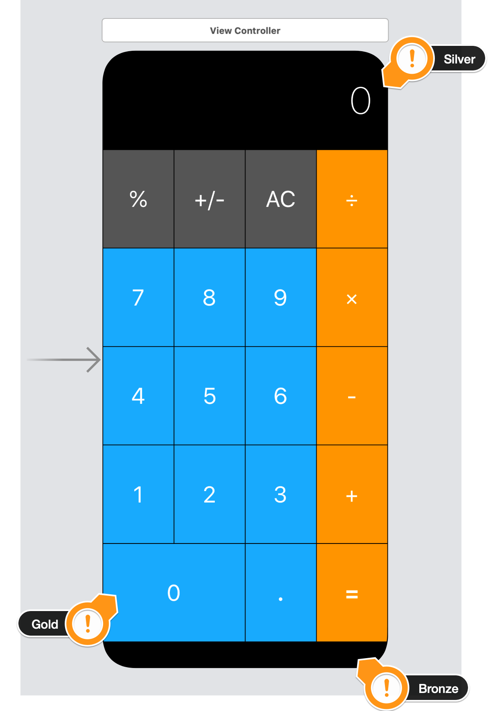

# Calculator App

A simple calculator. Using auto layout, stack views and setting constraints, create the following UI. 

## Technology implemented:
* UI Storyboard
* Computed Properties
* Struct
* Stack View
* Auto Layout
* Dynamically changing UI

<!-- 
## Portrait

## Landscape
 -->